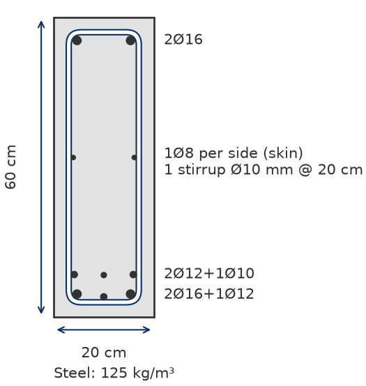

Beam
==========

The `Beam` class in the `mento` package is designed to model and analyze rectangular reinforced concrete beams.
It allows users to define the geometry, material properties, reinforcement and custom settings.

Key Concepts
------------

- **Beam Geometry**: Defined by `width` and `height`.
- **Material Properties**: Requires a `Concrete` object (e.g., `Concrete_ACI_318_19`) and a `SteelBar` object for reinforcement.
- **Reinforcement**: Longitudinal and transverse reinforcement can be defined using `set_longitudinal_rebar_bot`, `set_longitudinal_rebar_top`, and `set_transverse_rebar`.
- **Custom settings**: A `Beam` object can have custom settings overriding the default settings of `mento`.

Usage
-----

Below is a step-by-step guide on how to use the `Beam` class in your design workflows.

1. Creating a Beam Object
*************************

To define a beam, you need to specify its geometry, material properties, and clear cover.
The `RectangularBeam` class is used for this purpose. If no custom settings are passed to the *Beam* object, it will take the default values.

.. image:: ../_static/beam/beam.png
   :alt: Beam cross section.
   :width: 250px
   :align: center

.. code-block:: python

    from mento import Concrete_ACI_318_19, SteelBar, RectangularBeam, mm, cm, kN, MPa

    # Define materials
    concrete = Concrete_ACI_318_19(name="C25", f_c=25*MPa)
    steel = SteelBar(name="ADN 420", f_y=420*MPa)

    # Define beam geometry
    beam = RectangularBeam(label="101", concrete=concrete, steel_bar=steel, width=20*cm, height=60*cm, c_c = 2.5*cm)

2. Setting Reinforcement
************************

You can define the longitudinal and transverse reinforcement for the beam using the following methods:

- **Bottom Longitudinal Reinforcement**: Use `set_longitudinal_rebar_bot`.
- **Top Longitudinal Reinforcement**: Use `set_longitudinal_rebar_top`.
- **Transverse Reinforcement (Stirrups)**: Use `set_transverse_rebar`.

.. note::
    Consider that:

    - If no transverse reinforcement is defined, it is assumed that plain concrete will resist shear forces.
    - If no longitudinal reinforcement is defined, a minimum of 2Ø8 will be considered for metric system or 2#3 for imperial system of units. Mento won't check a beam without longitudinal rebar.
    - Skin rebar is not considered for the check or design of the beam.

**Transverse reinforcement**
This is set indicating the number of legs across the shear plane, the diameter of the stirrups and their
spacing along the beam. One closed stirrup is two legs:

.. code-block:: python

    beam.set_transverse_rebar(n_legs=2, d_b=10*mm, s_l=20*cm)   # 1 stirrup
    beam.set_transverse_rebar(n_legs=4, d_b=8*mm, s_l=20*cm)    # 1 stirrup + 2 legs

Any whole number of legs from two is accepted, odd counts included; a single leg is an error.
``n_stirrups=2``, the older keyword, still means four legs. Zero legs with zero diameter and spacing
removes the stirrups. See `Stirrup cages with more than two legs`_ for how the legs are tied.

**Longitudinal reinforcement**
This is set indicating rebar for two layers, differentiating between border bars and inner bars.
Each group of bars, for each layer has a unique number id. Bars can be defined both for top and bottom of the beam,
which will be considered for negative and positive bending moments respectively.

In case a flexure analysis requires compression reinforcement additional to the tension reinforcement, the opposite reinforcement will be considered.
For example, if a positive moment is so large that the section must be reinforced at top&bottom, the top rebar will also be considered in the beam capacity for flexure.

.. image:: ../_static/beam/beam_long_rebar.png
   :alt: Beam longitudinal rebar layout.
   :width: 700px
   :align: center

.. code-block:: python

    # Set bottom longitudinal reinforcement: two layers
    beam.set_longitudinal_rebar_bot(n1=2, d_b1=16*mm, n2=1, d_b2=12*mm, n3=2, d_b3=12*mm, n4=1, d_b4=10*mm)

    # Set top longitudinal reinforcement
    beam.set_longitudinal_rebar_top(n1=2, d_b1=16*mm)

    # Set transverse reinforcement (stirrups)
    beam.set_transverse_rebar(n_legs=2, d_b=10*mm, s_l=20*cm)

3. Assigning Forces to the Beam
*******************************

Forces are applied to the beam through a `Node` object, which joins the `Beam` and `Forces` object together.
See the `Node` section for more information on how to create a `Node` and assign forces to the section.

4. Performing Checks
********************

Once the beam is defined and forces are assigned in a `Node` object, you can perform checks for shear and flexure.
See the `Node` section for more information on how to create a Node and check the section.

5. Design the section
*********************

If you don't assign transverse or longitudinal rebar, you can ask *Mento* to design for shear and flexure.
See the `Node` section for more information on how to create a Node and design the section.

6. Jupyter Notebook Results
***************************

After performing the checks, you can view the results in a formatted way in a Notebook.

When you run `node.results`, the output includes:

- **Top and bottom longitudinal reinforcement**.
- **Shear reinforcement**.
- **Applied moments and shear forces**.
- **Design capacity ratios (DCR)**.
- **Warnings** (if any).

The output is formatted using LaTeX math notation for clarity and precision.

Example Output
--------------

Here’s an example of the output from `beam.results`, for the beam set up above checked under two
combinations, :math:`M_u = -80 \, \textsf{kNm}` with :math:`V_u = 80 \, \textsf{kN}`, and
:math:`M_u = 90 \, \textsf{kNm}`:

.. math::

    \textsf{Beam 101}, \, b = 20.00 \, \textsf{cm}, \, h = 60.00 \, \textsf{cm}, \, c_{\text{c}} = 2.50 \, \textsf{cm}, \, \textsf{Concrete C25}, \, \textsf{Rebar ADN 420}.

    \textsf{Top longitudinal rebar: } 2\phi16, \, A_{s,\text{top}} = 4.02 \, \textsf{cm}^2, \, M_u = -80 \, \textsf{kNm}, \, \phi M_n = 81.65 \, \textsf{kNm} \rightarrow \textsf{DCR} = 0.98

    \textsf{Bottom longitudinal rebar: } 2\phi16 + 1\phi12 ++ 2\phi12 + 1\phi10, \, A_{s,\text{bot}} = 8.2 \, \textsf{cm}^2, \, M_u = 90 \, \textsf{kNm}, \, \phi M_n = 155.7 \, \textsf{kNm} \rightarrow \textsf{DCR} = 0.58

    \textsf{Shear reinforcing: 1 stirrup } \phi10 \, \textsf{mm @ 20 cm} \cdot \textsf{14 cm between legs (max 54.29 cm)}, \, A_v = 7.85 \, \textsf{cm}^2/\textsf{m}, \, V_u = 80 \, \textsf{kN}, \, \phi V_n = 203.52 \, \textsf{kN} \rightarrow \textsf{DCR} = 0.39

Interpreting the Output
-----------------------

**Geometry and Materials**

The first line provides the beam's geometry and material properties:

- **Beam 101**: Beam identifier.
- :math:`b = 20.00 \, \textsf{cm}`: Beam width.
- :math:`h = 60.00 \, \textsf{cm}`: Beam height.
- :math:`c_{\text{c}} = 2.50 \, \textsf{cm}`: Concrete clear cover.
- **Concrete C25**: Concrete grade.
- **Rebar ADN 420**: Rebar grade.

**Longitudinal Reinforcement**

- **Top longitudinal rebar**: Reinforcement at the top of the beam.

  - :math:`2\phi16``: 2 bars of 16 mm diameter.
  - :math:`A_{s,\text{top}} = 4.02 \, \textsf{cm}^2`: Area of top reinforcement.
  - :math:`M_u = -80 \, \textsf{kNm}`: Applied moment at the top.
  - :math:`\phi M_n = 81.65 \, \textsf{kNm}`: Design moment capacity at the top.
  - :math:`\textsf{DCR} = 0.98`: Design capacity ratio :math:`\textsf{DCR} = M_u / \phi M_n`.

- **Bottom longitudinal rebar**: Reinforcement at the bottom of the beam.

  - :math:`2\phi16 + 1\phi12 ++ 2\phi12 + 1\phi10`: Combination of bars.
  - :math:`A_{s,\text{bot}} = 8.2 \, \textsf{cm}^2`: Area of bottom reinforcement.
  - :math:`M_u = 90 \, \textsf{kNm}`: Applied moment at the bottom.
  - :math:`\phi M_n = 155.7 \, \textsf{kNm}`: Design moment capacity at the bottom.
  - :math:`\textsf{DCR} = 0.58`: Design capacity ratio :math:`\textsf{DCR} = M_u / \phi M_n`.

**Shear Reinforcement**

- **Shear reinforcing**: Shear reinforcement details.

  - ``1 stirrup Ø10 mm @ 20 cm · 14 cm between legs (max 54.29 cm)``: one closed stirrup of
    10 mm, so two legs across the shear plane, every 20 cm along the beam; the legs are
    14 cm apart across the width, against the 54.29 cm Table 9.7.6.2.2 allows.
  - :math:`A_v = 7.85 \, \textsf{cm}^2/\textsf{m}`: Area of shear reinforcement per meter.
  - :math:`V_u = 80 \, \textsf{kN}`: Applied shear force.
  - :math:`\phi V_n = 203.52 \, \textsf{kN}`: Design shear capacity.
  - :math:`\textsf{DCR} = 0.39`: Design capacity ratio :math:`\textsf{DCR} = V_u / \phi V_n`.

- **Check DCR Values**: A DCR less than 1.0 indicates that the beam is safe under the applied loads.
- **Review Warnings**: If the output includes warnings, review the design to ensure compliance with code requirements. You can check detailed results for more information.

7. Detailed Results
*******************

See the `Node` section for more information on how to display and save detailed results of the analysis.

8. Plot section
***************

``beam.plot()`` draws the cross-section with the reinforcement the section carries:

.. code-block:: python

    beam.plot()

- **On the right**: the bars of each layer, the skin per side where there is skin, and the
  stirrups (``1 stirrup Ø10 mm @ 20 cm``).
- **Below**: the steel ratio of the section, in kg/m³ (lb/yd³ in US customary units).
- **Bars and stirrups** are drawn where the detailing puts them, ``beam.detailing_geometry``
  (see :ref:`user_guide/design_results`): the corner bars seated in the bends of the stirrup,
  the legs between its two as crossties.
- **Language and units**: the words follow ``mento.set_language``; a US customary section is
  drawn in inches, with ASTM bar sizes.

Where the bars of a face do not reach every corner of the cage, mounting bars fill them,
labelled ``(mounting)``. Their diameter is ``settings.mounting_bar_diameter`` (8 mm / No. 3 by
default) and they are not credited to the resistance. A 50 x 60 cm beam with seven bottom
bars, three top bars and four legs gets one:

.. code-block:: python

    beam = RectangularBeam(label="B2", concrete=concrete, steel_bar=steel, width=50*cm, height=60*cm, c_c=30*mm)
    beam.set_longitudinal_rebar_bot(n1=7, d_b1=20*mm)
    beam.set_longitudinal_rebar_top(n1=3, d_b1=16*mm)
    beam.set_transverse_rebar(n_legs=4, d_b=8*mm, s_l=20*cm)
    Node(section=beam, forces=[
        Forces(label="Positive", M_y=100*kNm, V_z=100*kN),
        Forces(label="Negative", M_y=-80*kNm, V_z=100*kN),
    ]).check()
    beam.plot()

.. image:: /_static/beam_detailing_7_3_4.png
   :alt: Seven Ø20 bottom bars, three Ø16 top bars with one Ø8 mounting bar, one Ø10 skin bar per side, a perimeter stirrup and two inner legs.
   :width: 450px
   :align: center

The drawing is a cross-section, not a bending schedule: anchorage, hooks and seismic
detailing are not checked. If the bars and stirrups cannot be laid out -- a stirrup too
narrow for its bends, bars that do not fit -- ``plot()`` draws the section as the calculation
assumes it, and ``beam.warnings`` says why (``cage_detailing_infeasible``).

Longitudinal skin reinforcement
*******************************

Every beam 60 cm (24 in.) deep or more gets skin bars on both side faces, spread over the
height between the bottom and top layers. mento lays them out with one criterion, the same
under every code:

- **Bars per side**: as many as keep them at most the code's spacing apart -- ACI 318-19 /
  CIRSOC 201-25 §24.3.2 with the side cover (about 28 cm with ADN 420), 28 cm under
  EN 1992-1-1 (``BeamSettings.skin_bar_spacing``).
- **Diameter below 1 m**: Ø8 up to a 40 cm web, Ø10 for wider webs (No. 3 / No. 4).
- **Diameter from 1 m**: the smallest that gives, in the tension zone, the minimum area of
  EN 1992-1-1 §7.3.3(3), with more bars if no diameter does.

.. image:: /_static/beam_skin.png
   :alt: CIRSOC 30 x 120 cm beam designed for +700 / -500 kN·m, with three Ø10 skin bars per side over the whole height.
   :width: 300px
   :align: center

Read it after a check or a design:

.. code-block:: python

    node.design()
    skin = beam.skin_reinforcement
    skin.status        # "required" where the code asks for skin, "proposed" where mento adds it
    skin.n_per_side, skin.d_b, skin.spacing

``required`` is where the code itself asks for skin (ACI / CIRSOC above 90 cm, EN from 1 m);
``proposed`` is mento's criterion below that. Skin is never credited to the moment or shear
capacity. The reasoning behind each rule, and a table of what it gives, is in
:doc:`../theory/beam_aci_318_19` and :doc:`../theory/beam_en_1992_2004`.

**Manual skin.** To place your own instead, the same on both sides:

.. code-block:: python

    beam.set_skin_rebar(d_b=10*mm, n_per_side=3, position="total")
    beam.skin_verification_status    # "passed", "failed" or "pending"
    beam.clear_skin_rebar()          # back to mento's criterion

``position`` is ``"total"`` for the whole height, ``"bottom"`` or ``"top"`` for the half
next to that face. mento keeps the count you give, checks it and reports what it misses in
``beam.warnings``. ``BeamSummary`` reads the same from three optional columns, ``db_skin``,
``n_skin`` and ``pos_skin``.

Not covered: torsion, imposed deformations, the EN Annex J surface mesh, anchorage and
splices of the skin bars.

Stirrup cages with more than two legs
*************************************

The cage is one closed perimeter stirrup and the remaining legs as single pieces between
its two, which is how the notation writes it: ``n_legs=7`` reads
``1 stirrup + 5 legs Ø10 mm @ 15 cm``.

- **A bar at every leg.** A design gives the face in tension at least as many bars as the
  section has legs, taking more, smaller bars when it has to.
- **Compression bars.** Where a face relies on compression steel (ACI 318-19 / CIRSOC
  201-25 §9.7.6.4.4), the detailing turns inner legs into 135°/90° crossties that hold those
  bars. If the legs you entered are not enough it proposes more and says so in
  ``beam.warnings``; the extra legs are drawn but never added to :math:`A_v`.
- **What is checked.** Covers, clear spacings and clashes between bars, stirrups and
  crossties, with the bend diameters of ACI / CIRSOC Table 25.3.2 or EN Table 8.1N (four
  diameters for CIRSOC Ø6 and Ø8 stirrups, which its table does not reach). When no layout
  is found the result stays failed or pending; nothing passes by default.
- **What is not.** Anchorage, the hooks of plain legs, splices, seismic detailing, and the
  alternation of crosstie ends along the beam that §25.3.5 asks for (each crosstie carries
  it as ``alternate_hooks``). Under EN the support of compression bars is not verified.

``n_stirrups`` is a two-leg equivalent kept for older code, not a count of closed pieces:
read ``n_legs`` for the count, and ``beam.detailing_geometry.stirrups`` and ``.crossties``
for the pieces.
